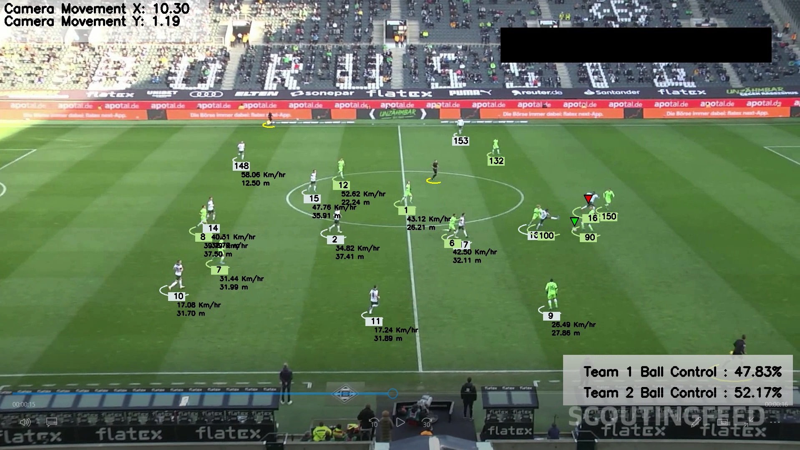

# ⚽ Football-analysis-YOLO

Implemented a comprehensive computer vision and machine learning project for football video analysis, employing YOLO for real-time player detection, K-means clustering for field segmentation, optical flow for motion vector estimation, and perspective transformation for accurate player trajectory analysis.

---

## 🖼️ Output Frame Preview

> **Above:** The system detecting players, assigning teams, estimating motion, and transforming views during real-time match footage analysis.

---

## 🧠 Key Features

- YOLO-based player and ball detection
- Optical flow to estimate camera movement
- K-Means clustering for team and field segmentation
- Perspective transformation to bird's-eye view
- Visual player tracking and trajectory mapping

---

